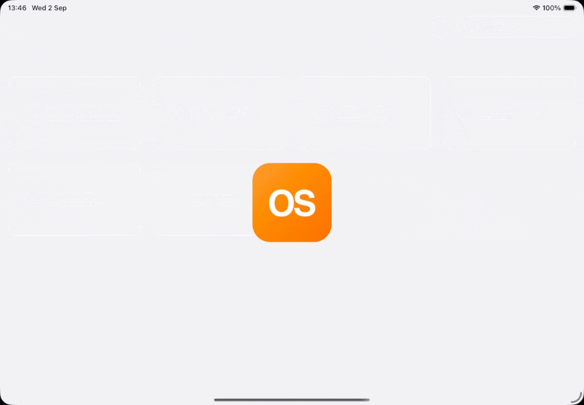

# Order Studio

A B2B e‑commerce **demo** app for iPad and iPhone (SwiftUI), styled with the
[ModernDesignSystem](https://github.com/kamilkk/ModernDesignSystem) package. Each screen
takes the accent of the currently selected brand, so tiles, avatars, charts, links and
glyphs all re‑tint when the brand changes.

**Target:** iOS 18+ · Xcode 26 · Swift 5 language mode · iPhone + iPad.


## Showcase 



## Structure

A thin XcodeGen app target over local Swift packages; the app is just the entry point and
all feature code lives in packages.

```
Apps/OrderStudio/            # app target (entry point + Resources/OrderStudio.xcassets)
Packages/
  Shared/                    # placeholder for shared code
  OrderStudioCore/           # models + embedded JSON sample data (Customer, Order, Brand, …)
  OrderStudioUI/             # design-system glue, shared UI helpers
  OrderStudioFeatures/       # screens: Brands, Home, Customers, Orders, Collection, Settings
OrderStudio.xcworkspace      # groups the app project + packages
```

`OrderStudioUI` depends on the remote **ModernDesignSystem** package; features depend on
Core + UI. Fake data ships as JSON resources in `OrderStudioCore` and is decoded at
runtime, so it's easy to replace or swap for a real persistence layer later.

## Getting started

```bash
brew install xcodegen fastlane swiftformat pre-commit
fastlane generate_projects   # regenerate the Xcode project from project.yml
open OrderStudio.xcworkspace
```

Fastlane lanes: `generate_projects`, `dev_start` (regenerate + open), `build_all`,
`test_all`. SwiftFormat runs on commit via pre-commit.

> The generated `Apps/*/*.xcodeproj` is git‑ignored — the sources of truth are
> `project.yml`, the packages, and the workspace. Run `generate_projects` after pulling.
